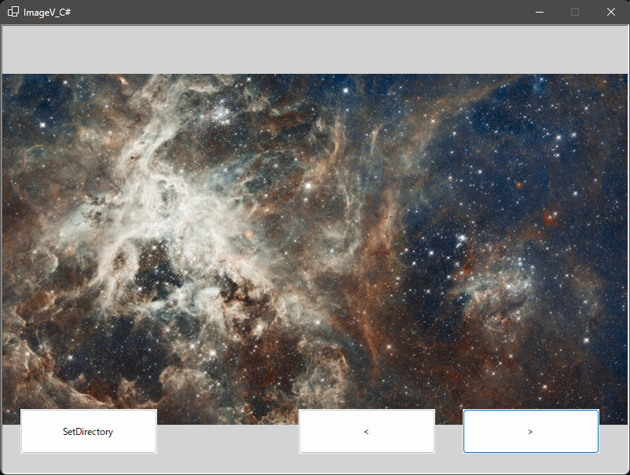

# ImageV_C# - Image Viewer

A simple and intuitive image viewer application built with C# and Windows Forms.

## Features

- Browse and select image directories
- View images in a clean, resizable interface
- Navigate through images with left/right controls
- Support for multiple image formats (JPG, JPEG, PNG, BMP, GIF)
- Automatic image scaling to fit the window
- Load up to 100 images per directory for optimal performance

## Screenshot



## Requirements

- .NET 8.0 or later
- Windows operating system
- Windows Forms support

## How to Use

1. Run the `ImageV_C#.exe` application
2. Click "Set Directory" to choose a folder containing images
3. Use the left and right navigation buttons to browse through images
4. Images will automatically scale to fit the viewing window

## Building from Source

```bash
dotnet build ImageV_C#.sln
```

## License

This project is licensed under the MIT License - see the [LICENSE](LICENSE) file for details.